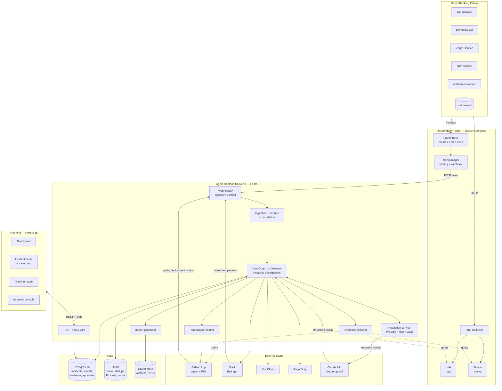
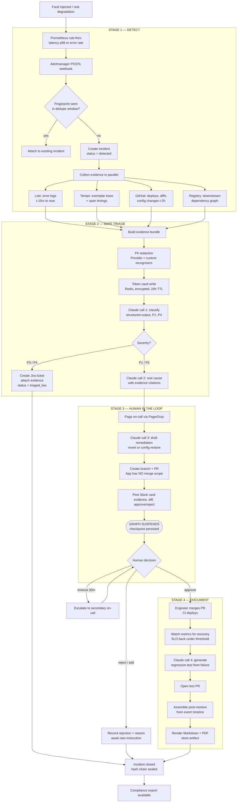
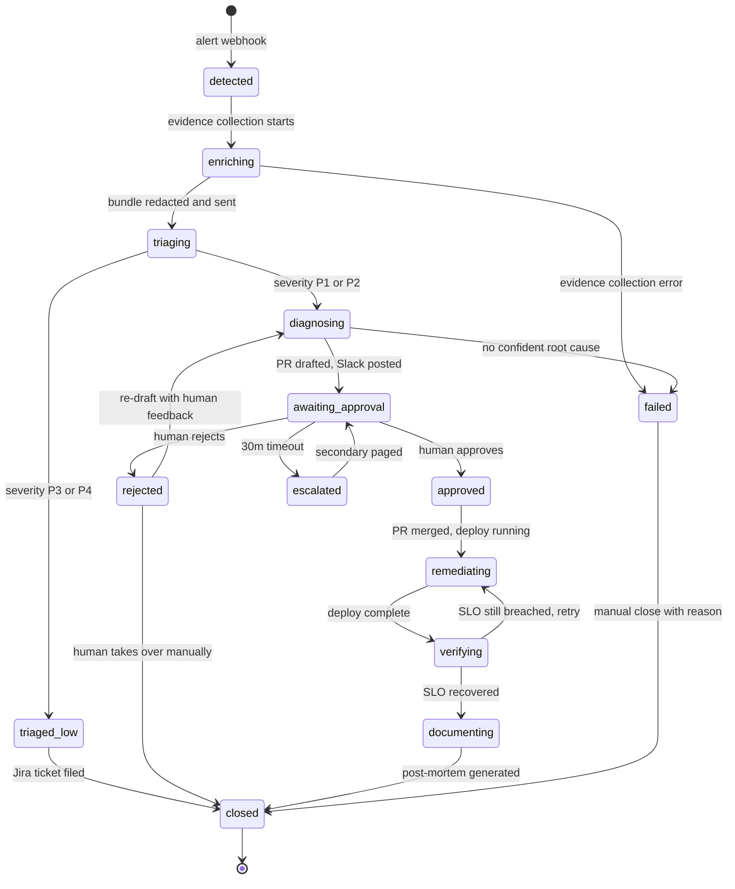
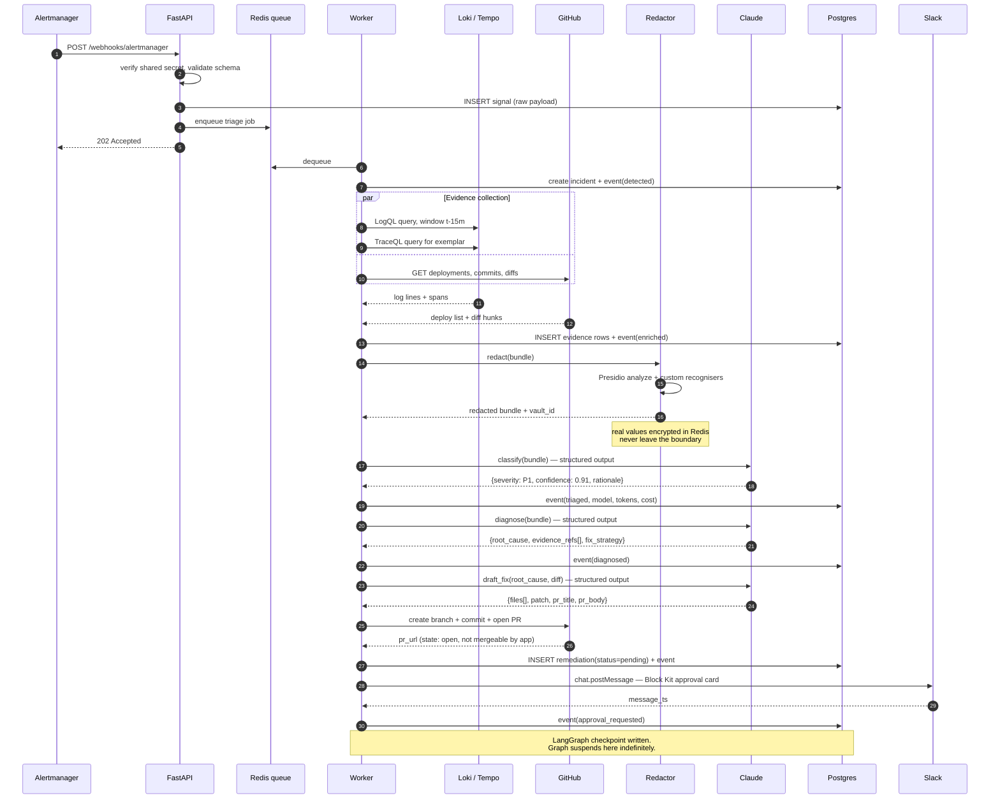
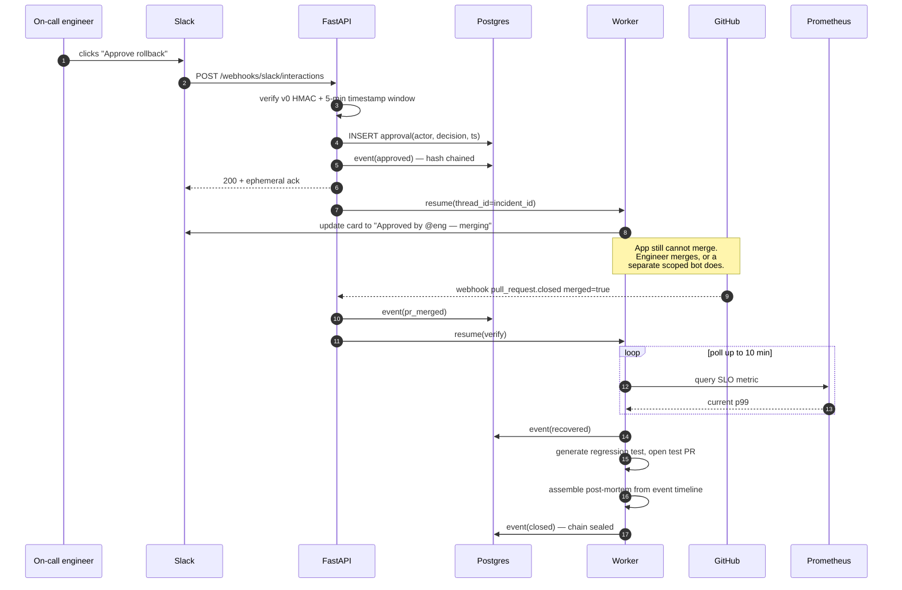
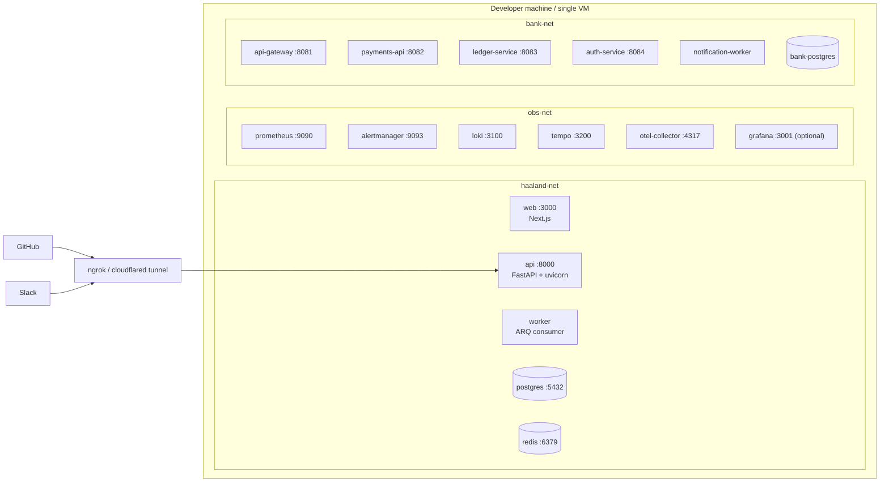

# 01 — Architecture

## Design stance

Three decisions shape everything else:

1. **Event-sourced incidents.** The `incident_events` table is append-only and hash-chained. Current incident state is a projection over it. This costs a little query complexity and buys the compliance story for free — you cannot produce a tamper-evident audit trail by writing an audit log *alongside* mutable state, because the two can diverge.

2. **The orchestrator is a durable state machine, not a chat loop.** Incident response has hard human-approval gates that can last hours. A conversational agent loop cannot survive a backend redeploy mid-incident. A checkpointed graph can — it suspends, persists, and resumes.

3. **Adapters at every boundary.** `SignalSource`, `LogSource`, `TraceSource`, `SCMProvider`, `Notifier`, `TicketProvider`. The diagnosis engine talks to interfaces. Swapping Prometheus for Datadog is a config change plus one class.

---

## System component diagram

---

## End-to-end incident workflow

This is the diagram to put on a slide.

---

## Incident state machine

Every transition writes an `incident_events` row. Illegal transitions are rejected at the service layer, not just discouraged.

---

## Sequence: alert to pending pull request

---

## Sequence: human approval resumes the graph

---

## Deployment topology

For the prototype, one machine, one `docker compose up`.

A public tunnel is required only because GitHub and Slack must reach the webhook endpoints. Alertmanager talks to the API over the internal Docker network.

## Why a worker process at all

The alert webhook must return `202` in well under a second — Alertmanager retries aggressively and a slow endpoint causes duplicate alerts. Evidence collection plus three or four LLM calls takes 20–90 seconds. So the HTTP handler does exactly three things: verify, persist the raw signal, enqueue. Everything else happens in the worker.

This also means a backend restart mid-incident loses nothing: the job is in Redis, the graph checkpoint is in Postgres.
