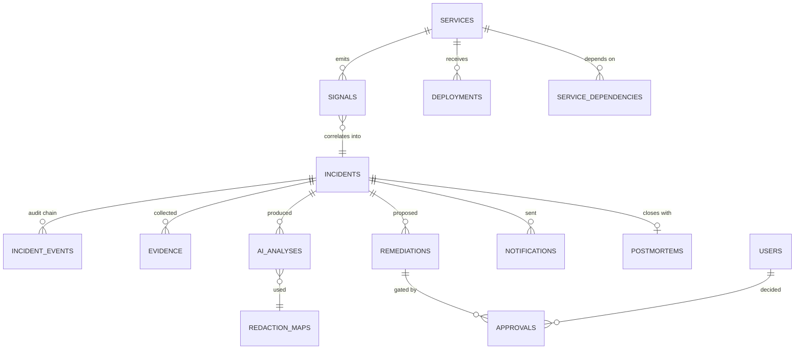

# 03 — Data Model

## Do we need a database?

Yes, and it is not incidental. The product's differentiating claim is *"complete, audit-ready timelines."* That claim requires durable, ordered, tamper-evident storage of every action taken by machine and human. There is no version of this product that stores state only in memory or only in the LLM's context window.

What we do **not** store: raw metrics (Prometheus owns those), full log archives (Loki owns those), full traces (Tempo owns those). We store *references plus the specific excerpt that was used as evidence*, so that the post-mortem is reproducible even after the log retention window expires.

---

## Entity relationship overview



---

## Schema

Written as Postgres DDL. Alembic migrations mirror this exactly.

### Reference data

```sql
CREATE TYPE severity AS ENUM ('P1','P2','P3','P4');
CREATE TYPE incident_status AS ENUM (
  'detected','enriching','triaging','triaged_low','diagnosing',
  'awaiting_approval','escalated','approved','rejected',
  'remediating','verifying','documenting','closed','failed'
);
CREATE TYPE actor_type AS ENUM ('system','ai','human','integration');

-- Registry of everything we monitor. Seeded from a YAML file.
CREATE TABLE services (
  id            uuid PRIMARY KEY DEFAULT gen_random_uuid(),
  name          text NOT NULL UNIQUE,          -- 'payments-api'
  repo_full_name text,                          -- 'acme-bank/payments-api'
  tier          smallint NOT NULL DEFAULT 2,    -- 1 = customer-facing critical
  owner_team    text,
  slack_channel text,
  pagerduty_service_id text,
  runbook_url   text,
  slo_p99_ms    integer,
  metadata      jsonb NOT NULL DEFAULT '{}',
  created_at    timestamptz NOT NULL DEFAULT now()
);

CREATE TABLE service_dependencies (
  upstream_id   uuid NOT NULL REFERENCES services(id) ON DELETE CASCADE,
  downstream_id uuid NOT NULL REFERENCES services(id) ON DELETE CASCADE,
  kind          text NOT NULL,                  -- 'http' | 'grpc' | 'queue' | 'db'
  critical      boolean NOT NULL DEFAULT false,
  PRIMARY KEY (upstream_id, downstream_id)
);

CREATE TABLE users (
  id            uuid PRIMARY KEY DEFAULT gen_random_uuid(),
  email         citext NOT NULL UNIQUE,
  display_name  text NOT NULL,
  slack_user_id text UNIQUE,
  github_login  text UNIQUE,
  role          text NOT NULL DEFAULT 'engineer', -- engineer | approver | compliance | admin
  is_active     boolean NOT NULL DEFAULT true,
  created_at    timestamptz NOT NULL DEFAULT now()
);
```

### Signals — the raw inbound alerts

We keep the untouched webhook payload forever. If our parser was wrong, the original is still there.

```sql
CREATE TABLE signals (
  id            uuid PRIMARY KEY DEFAULT gen_random_uuid(),
  source        text NOT NULL,                  -- 'alertmanager' | 'sentry' | 'datadog'
  fingerprint   text NOT NULL,                  -- source-provided idempotency key
  service_id    uuid REFERENCES services(id),
  severity_hint text,
  summary       text NOT NULL,
  started_at    timestamptz NOT NULL,
  resolved_at   timestamptz,
  labels        jsonb NOT NULL DEFAULT '{}',
  raw_payload   jsonb NOT NULL,                 -- never modified
  incident_id   uuid REFERENCES incidents(id),
  received_at   timestamptz NOT NULL DEFAULT now()
);
CREATE UNIQUE INDEX uq_signal_dedupe
  ON signals (source, fingerprint, started_at);
CREATE INDEX ix_signals_incident ON signals (incident_id);
```

### Incidents — the aggregate root

Note the deliberate redundancy: `status` and `severity` are denormalised projections of the event chain, maintained transactionally with the event insert. Queries read the projection; audits read the chain. If they ever disagree, the chain wins and that is a bug alert.

```sql
CREATE TABLE incidents (
  id                uuid PRIMARY KEY DEFAULT gen_random_uuid(),
  reference         text NOT NULL UNIQUE,       -- 'INC-2026-0042', human-quotable
  title             text NOT NULL,
  status            incident_status NOT NULL DEFAULT 'detected',
  severity          severity,
  severity_confidence real,
  primary_service_id uuid REFERENCES services(id),
  affected_service_ids uuid[] NOT NULL DEFAULT '{}',
  suspected_deployment_id uuid REFERENCES deployments(id),

  detected_at       timestamptz NOT NULL DEFAULT now(),
  acknowledged_at   timestamptz,
  triaged_at        timestamptz,
  diagnosed_at      timestamptz,
  approved_at       timestamptz,
  recovered_at      timestamptz,
  closed_at         timestamptz,

  root_cause_summary text,
  closed_reason     text,
  chain_head_hash   bytea,                      -- latest event hash, for fast verify
  metadata          jsonb NOT NULL DEFAULT '{}'
);
CREATE INDEX ix_incidents_status ON incidents (status)
  WHERE status NOT IN ('closed','failed');
CREATE INDEX ix_incidents_detected ON incidents (detected_at DESC);
```

Derived metrics are computed, never stored:
- **MTTD** = `detected_at - signals.started_at`
- **MTTA** = `acknowledged_at - detected_at`
- **MTTR** = `recovered_at - detected_at`

### `incident_events` — the audit chain

This is the compliance artefact. Everything else in the schema is an optimisation.

```sql
CREATE TABLE incident_events (
  id            bigint GENERATED ALWAYS AS IDENTITY PRIMARY KEY,
  incident_id   uuid NOT NULL REFERENCES incidents(id) ON DELETE RESTRICT,
  seq           integer NOT NULL,               -- 1-based, per incident
  event_type    text NOT NULL,                  -- 'alert.received', 'ai.classified', ...
  actor_type    actor_type NOT NULL,
  actor_id      text,                           -- user uuid | model id | 'alertmanager'
  actor_label   text NOT NULL,                  -- display: 'Priya N.' | 'claude-opus-5'
  summary       text NOT NULL,                  -- one line, post-mortem ready
  payload       jsonb NOT NULL DEFAULT '{}',
  occurred_at   timestamptz NOT NULL DEFAULT now(),

  prev_hash     bytea,                          -- NULL only for seq = 1
  hash          bytea NOT NULL,

  UNIQUE (incident_id, seq)
);
CREATE INDEX ix_events_incident_seq ON incident_events (incident_id, seq);
CREATE INDEX ix_events_type ON incident_events (event_type);

-- Immutability is a database constraint, not an application convention.
CREATE OR REPLACE FUNCTION reject_event_mutation() RETURNS trigger AS $$
BEGIN
  RAISE EXCEPTION 'incident_events is append-only (attempted % on id=%)',
    TG_OP, COALESCE(OLD.id, NEW.id);
END;
$$ LANGUAGE plpgsql;

CREATE TRIGGER trg_events_append_only
  BEFORE UPDATE OR DELETE ON incident_events
  FOR EACH ROW EXECUTE FUNCTION reject_event_mutation();
```

#### The hash chain

```
hash(n) = SHA256(
    prev_hash(n)                     -- 32 zero bytes when seq = 1
  || incident_id                     -- uuid bytes
  || seq            (big-endian u32)
  || event_type     (utf-8)
  || actor_type     (utf-8)
  || actor_label    (utf-8)
  || summary        (utf-8)
  || canonical_json(payload)         -- RFC 8785 JCS: sorted keys, no whitespace
  || occurred_at    (RFC3339 UTC, microsecond precision)
)
```

**Canonicalisation is the part people get wrong.** `json.dumps(payload)` is not deterministic across insertion orders. Use a JCS implementation, pin it, and write a test that asserts a known payload produces a known hash — that test is the regression net for the entire compliance claim.

Verification endpoint: `GET /api/incidents/{id}/audit/verify` walks the chain, recomputes each hash, and returns `{valid, events_checked, first_divergence_seq}`.

**Honest limitation:** a hash chain proves *internal* consistency. Someone with database write access could rewrite the whole chain from a chosen point. Production hardening (Phase 6): periodically publish the chain head to an append-only external store — a WORM S3 bucket with Object Lock, or a signed daily digest to a separate account. Say this out loud rather than overclaiming.

#### Canonical event types

| Event type | Actor | Emitted when |
|---|---|---|
| `alert.received` | integration | Webhook accepted |
| `alert.correlated` | system | Signal attached to existing incident |
| `incident.opened` | system | New incident created |
| `evidence.collected` | system | Logs / traces / deploys retrieved (one row per source) |
| `pii.redacted` | system | Bundle sanitised; records entity counts, never values |
| `ai.classified` | ai | Severity assigned |
| `ai.diagnosed` | ai | Root cause produced |
| `ai.remediation_drafted` | ai | Patch generated |
| `ai.refused` | ai | Model returned `stop_reason: refusal` |
| `pr.opened` | integration | GitHub PR created |
| `notification.sent` | integration | Slack / PagerDuty / Jira dispatched |
| `approval.requested` | system | Graph suspended at the gate |
| `approval.granted` | human | Approve clicked |
| `approval.denied` | human | Reject clicked, with reason |
| `approval.escalated` | system | Timeout, secondary paged |
| `pr.merged` | human | Merge webhook received |
| `deploy.completed` | integration | `deployment_status: success` |
| `metrics.recovered` | system | SLO back under threshold |
| `test.generated` | ai | Regression test drafted |
| `postmortem.generated` | system | Report assembled |
| `incident.closed` | system / human | Chain sealed |
| `human.note` | human | Free-text annotation from the UI |

### Evidence

```sql
CREATE TABLE evidence (
  id            uuid PRIMARY KEY DEFAULT gen_random_uuid(),
  incident_id   uuid NOT NULL REFERENCES incidents(id) ON DELETE CASCADE,
  kind          text NOT NULL,        -- 'log' | 'trace' | 'metric' | 'deploy' | 'config' | 'runbook'
  source        text NOT NULL,        -- 'loki' | 'tempo' | 'prometheus' | 'github'
  source_ref    text,                 -- trace_id, commit sha, query string
  window_start  timestamptz,
  window_end    timestamptz,
  content       jsonb NOT NULL,       -- REDACTED excerpt actually used
  content_raw_ref text,               -- pointer into object store if raw was archived
  relevance     real,                 -- 0..1, used to rank into the token budget
  collected_at  timestamptz NOT NULL DEFAULT now()
);
CREATE INDEX ix_evidence_incident_kind ON evidence (incident_id, kind);
```

`content` stores the **redacted** excerpt — the same bytes the model saw. This makes an AI decision reproducible during an audit without re-exposing customer data.

### Deployments — mirrored from GitHub

```sql
CREATE TABLE deployments (
  id            uuid PRIMARY KEY DEFAULT gen_random_uuid(),
  service_id    uuid NOT NULL REFERENCES services(id),
  provider      text NOT NULL DEFAULT 'github',
  external_id   text NOT NULL,
  commit_sha    text NOT NULL,
  previous_sha  text,
  ref           text,
  author_login  text,
  pr_number     integer,
  environment   text NOT NULL DEFAULT 'production',
  status        text NOT NULL,        -- pending | success | failure
  changed_files text[],
  diff_summary  jsonb,                -- {files, additions, deletions, hunks[]}
  deployed_at   timestamptz NOT NULL,
  UNIQUE (provider, external_id)
);
CREATE INDEX ix_deployments_service_time ON deployments (service_id, deployed_at DESC);
```

The correlation query that finds the culprit deploy — deliberately simple, deliberately explainable:

```sql
SELECT * FROM deployments
WHERE service_id = ANY(:affected_service_ids)
  AND deployed_at BETWEEN :incident_start - interval '2 hours' AND :incident_start
ORDER BY deployed_at DESC;
```

The model ranks these; the query does not guess.

### AI analyses — every model call is recorded

```sql
CREATE TABLE ai_analyses (
  id                uuid PRIMARY KEY DEFAULT gen_random_uuid(),
  incident_id       uuid NOT NULL REFERENCES incidents(id) ON DELETE CASCADE,
  stage             text NOT NULL,    -- 'classify' | 'diagnose' | 'remediate' | 'test' | 'report'
  model             text NOT NULL,    -- 'claude-opus-5'
  prompt_version    text NOT NULL,    -- 'diagnose@v3' — pinned, in git
  prompt_hash       bytea NOT NULL,   -- sha256 of the rendered prompt
  redaction_map_id  uuid REFERENCES redaction_maps(id),
  request_payload   jsonb NOT NULL,   -- redacted request as sent
  response_payload  jsonb NOT NULL,   -- parsed structured output
  stop_reason       text,
  input_tokens      integer,
  output_tokens     integer,
  cache_read_tokens integer,
  cache_write_tokens integer,
  cost_usd          numeric(10,6),
  latency_ms        integer,
  created_at        timestamptz NOT NULL DEFAULT now()
);
CREATE INDEX ix_analyses_incident ON ai_analyses (incident_id, created_at);
```

Storing `prompt_version` and `prompt_hash` is what lets you answer an auditor's question: *"which exact instructions produced this decision on 3 March?"*

### Redaction maps

```sql
CREATE TABLE redaction_maps (
  id            uuid PRIMARY KEY DEFAULT gen_random_uuid(),
  incident_id   uuid NOT NULL REFERENCES incidents(id) ON DELETE CASCADE,
  vault_key     text NOT NULL,        -- Redis key; the values live there, encrypted
  entity_counts jsonb NOT NULL,       -- {"ACCOUNT_NUMBER": 4, "EMAIL": 2} — counts only
  recogniser_versions jsonb NOT NULL,
  created_at    timestamptz NOT NULL DEFAULT now(),
  expires_at    timestamptz NOT NULL  -- matches the Redis TTL
);
```

**No plaintext PII lands in Postgres.** The mapping lives only in Redis under AES-GCM with a key from the environment, with a TTL. After expiry the tokens in stored evidence become permanently opaque, which is the desired end state.

### Remediations and approvals

```sql
CREATE TABLE remediations (
  id            uuid PRIMARY KEY DEFAULT gen_random_uuid(),
  incident_id   uuid NOT NULL REFERENCES incidents(id) ON DELETE CASCADE,
  strategy      text NOT NULL,        -- 'revert_deploy' | 'config_restore' | 'scale' | 'feature_flag'
  rationale     text NOT NULL,
  risk_notes    text,
  repo_full_name text NOT NULL,
  branch_name   text NOT NULL,
  base_sha      text NOT NULL,
  patch         text NOT NULL,        -- unified diff
  pr_number     integer,
  pr_url        text,
  status        text NOT NULL DEFAULT 'pending',
                -- pending | approved | rejected | merged | superseded | expired
  created_at    timestamptz NOT NULL DEFAULT now(),
  resolved_at   timestamptz
);

CREATE TABLE approvals (
  id            uuid PRIMARY KEY DEFAULT gen_random_uuid(),
  remediation_id uuid NOT NULL REFERENCES remediations(id) ON DELETE CASCADE,
  user_id       uuid REFERENCES users(id),
  actor_label   text NOT NULL,
  decision      text NOT NULL,        -- 'approve' | 'reject' | 'request_changes'
  reason        text,
  channel       text NOT NULL,        -- 'slack' | 'web' | 'api'
  source_ip     inet,
  decided_at    timestamptz NOT NULL DEFAULT now()
);
CREATE INDEX ix_approvals_remediation ON approvals (remediation_id);
```

Approvals are a separate table from remediations specifically so that **four-eyes** — requiring two distinct approvers for tier-1 services — is a row count, not a schema change.

### Notifications and post-mortems

```sql
CREATE TABLE notifications (
  id            uuid PRIMARY KEY DEFAULT gen_random_uuid(),
  incident_id   uuid NOT NULL REFERENCES incidents(id) ON DELETE CASCADE,
  channel       text NOT NULL,        -- 'slack' | 'pagerduty' | 'jira' | 'email'
  target        text NOT NULL,        -- '#incidents-payments' | 'PD service id'
  external_ref  text,                 -- message ts / incident key / issue key
  status        text NOT NULL,        -- 'sent' | 'failed' | 'acknowledged'
  payload       jsonb NOT NULL,
  sent_at       timestamptz NOT NULL DEFAULT now()
);

CREATE TABLE postmortems (
  id            uuid PRIMARY KEY DEFAULT gen_random_uuid(),
  incident_id   uuid NOT NULL UNIQUE REFERENCES incidents(id) ON DELETE CASCADE,
  version       integer NOT NULL DEFAULT 1,
  markdown      text NOT NULL,
  pdf_ref       text,                 -- object store key
  generated_at  timestamptz NOT NULL DEFAULT now(),
  approved_by   uuid REFERENCES users(id),
  approved_at   timestamptz
);
```

### Runbooks (Phase 5, optional RAG)

```sql
CREATE EXTENSION IF NOT EXISTS vector;

CREATE TABLE runbook_chunks (
  id            uuid PRIMARY KEY DEFAULT gen_random_uuid(),
  service_id    uuid REFERENCES services(id),
  title         text NOT NULL,
  content       text NOT NULL,
  source_url    text,
  embedding     vector(1024),
  updated_at    timestamptz NOT NULL DEFAULT now()
);
CREATE INDEX ix_runbook_embedding ON runbook_chunks
  USING hnsw (embedding vector_cosine_ops);
```

---

## Retention policy

| Data | Retention | Why |
|---|---|---|
| `incident_events` | **Never deleted** | The compliance artefact. MAS TRM and DORA expect multi-year retention. |
| `incidents`, `approvals`, `postmortems` | Never deleted | Same |
| `evidence.content` (redacted) | 7 years | Regulatory default; already PII-free |
| `signals.raw_payload` | 90 days, then null the column | Raw alerts may contain unredacted labels |
| `redaction_maps` + Redis vault | **24 hours** | The shortest window that supports an active incident. After this the tokens are irreversible by design. |
| `ai_analyses.request_payload` | 2 years | Model-decision auditability |
| Object store artefacts | 7 years | Post-mortem PDFs |

The 24-hour vault TTL is a deliberate trade: after a day you cannot re-hydrate an old incident's account numbers. That is the correct default for a bank, and it means a database breach a week later exposes no customer identifiers.

---

## Migration discipline

- One Alembic revision per logical change; never edit a merged migration.
- `incident_events` and its trigger are created in the **first** migration and never altered — adding a column would change hash inputs and break verification of all prior events. If the shape must change, version it: `incident_events_v2` with a documented cutover.
- Seed data (`services`, `service_dependencies`, demo `users`) lives in `apps/api/seeds/*.yaml` and is applied by an idempotent script, not a migration.
