# 08 — Roadmap

Six phases. Each has a hard deliverable and an acceptance test you can actually run. The ordering is chosen so that **there is a demonstrable product at the end of every phase** — no phase is pure plumbing.

Effort estimates assume one experienced full-stack engineer working focused days.

```mermaid
gantt
    title Agent Haaland delivery
    dateFormat X
    axisFormat %s
    section Foundation
    P0 Scaffolding + observability     :p0, 0, 3
    section Core loop
    P1 Detect and trace                :p1, after p0, 4
    P2 Safe triage                     :p2, after p1, 4
    section The differentiator
    P3 Human-in-the-loop remediation   :p3, after p2, 5
    P4 Document and harden             :p4, after p3, 4
    section Polish
    P5 Breadth and depth               :p5, after p4, 5
    P6 Production hardening            :p6, after p5, 10
```



---

## Phase 0 — Foundation (2–3 days)

Everything runs, nothing is intelligent yet.

**Deliverables**

- Monorepo scaffolding: `apps/api` (FastAPI + uv), `apps/web` (Next.js + Tailwind + shadcn), `docker-compose.yml`.
- Postgres + Redis + Alembic, with migration `0001_core_schema` including `incident_events` and the append-only trigger.
- The observability plane: Prometheus, Alertmanager, Loki, Tempo, OTel Collector — all wired.
- Five demo banking services, auto-instrumented, emitting traces to Tempo, logs to Loki, metrics to Prometheus.
- A load generator producing steady baseline traffic.
- `/chaos` admin endpoints on each service plus the `demo/chaos/*.sh` scripts.
- `Makefile` with `up`, `seed`, `chaos-pool`, `reset`.
- `POST /webhooks/alertmanager` that verifies, persists a `signals` row, and returns 202.

**Acceptance**

```bash
make up && make seed
# wait 60s for baseline traffic
make chaos-pool
# within ~90s:
psql -c "select source, summary, received_at from signals order by received_at desc limit 1;"
# → one row from alertmanager
```

**Why first:** without a deterministic, breakable estate you cannot develop or demo anything downstream. This is the highest-leverage two days in the project.

---

## Phase 1 — Detect & Trace (3–4 days)

The agent sees, correlates, and shows. No AI yet — and that is deliberate. Prove the evidence pipeline works before adding a model on top of it, otherwise you will spend days debugging prompts when the real bug is a Loki query.

**Deliverables**

- `IncidentService`: signal → incident creation, with Redis fingerprint dedupe.
- `AuditService`: hash-chained `incident_events` append, with canonical JSON, plus `GET /api/incidents/{id}/audit/verify`.
- `EvidenceService`: parallel fan-out to Loki, Tempo, Prometheus, GitHub.
  - Loki adapter with **error-signature grouping** (500 lines → 5 signatures).
  - Tempo adapter with **span-tree reduction** and self-time computation.
- GitHub App registered; `push` / `deployment_status` webhooks mirroring into `deployments` with diff summaries.
- Deploy correlation query: which deploys landed on affected services in the 2h before detection.
- Frontend: `/incidents` feed with SSE, `/incidents/[ref]` overview with the evidence accordion, `/incidents/[ref]/trace` with the React Flow service map and span waterfall.

**Acceptance**

1. `make chaos-pool` → an incident appears in the dashboard within 30 seconds without a page refresh.
2. Its evidence accordion contains grouped error signatures, an exemplar trace, and the deployment list.
3. The trace map highlights `ledger-service` as the latency source.
4. `/audit/verify` returns `{valid: true}` with ≥6 events.

**Risk to watch:** Tempo's search API has been the flakiest part of the LGTM stack historically. If exemplar search proves unreliable, fall back to Jaeger all-in-one — same OTLP ingest, simpler query API, one line changed in `TraceSource`.

---

## Phase 2 — Safe Triage (3–4 days)

PII boundary and the first two model calls.

**Deliverables**

- `Redactor` with Presidio plus the banking recognisers, Luhn/mod-97 validators, and the deterministic pre-filter.
- AES-GCM token vault in Redis with the 24h TTL; `redaction_maps` rows recording counts only.
- The canary leakage test suite, wired into CI as a blocking check.
- LLM client with usage capture, retries, refusal handling, and budget enforcement.
- Prompt files under `prompts/` with load-time hashing and version pinning.
- Classification call (`Classification` schema) with the tier-1 and low-confidence overrides.
- Diagnosis call (`Diagnosis` schema) with `min_length=1` on supporting evidence.
- `ai_analyses` recording model, prompt version + hash, tokens, cache hits, cost, latency.
- Severity routing: P3/P4 → Jira ticket + close; P1/P2 → continue.
- Frontend: root cause card with confidence bar, AI reasoning disclosure, cost badge, `RedactedValue` masked chips.

**Acceptance**

1. `make chaos-pool` → incident classified P1 with confidence > 0.7.
2. The stated root cause names the `DB_POOL_SIZE` change and the correct commit SHA.
3. A synthetic incident with an in-error-budget blip classifies P3 and creates a Jira ticket without paging.
4. `grep` the recorded LLM request payloads for any canary value → zero hits.
5. `cache_read_input_tokens > 0` on the second incident, proving prompt caching is live.

---

## Phase 3 — Human-in-the-Loop (4–5 days)

The phase that makes this a product rather than a dashboard.

**Deliverables**

- LangGraph orchestrator with the Postgres checkpointer, replacing the ad-hoc pipeline from Phase 2.
- `interrupt()` at `request_approval` and `await_merge`.
- Remediation drafting (`RemediationDraft` schema) with post-parse path validation, denylist, and the 10-file ceiling.
- **Deterministic revert path**: when strategy is `revert_deploy`, compute the patch from `deployments.previous_sha`, use the model only for narrative.
- GitHub branch + commit + PR creation, with the branch protection configuration documented and applied to the demo repo.
- Slack Block Kit approval card with a confirmation dialog; the interaction endpoint with v0 signature verification and role authorisation.
- PagerDuty trigger for P1/P2 with `dedup_key = incident.reference`.
- Per-incident Slack channel creation with stakeholder invitation from the service registry.
- Approval timeout → escalation to secondary on-call.
- Rejection path: reason captured, state loops back to `draft_remediation` with the feedback in state.
- Frontend: `/remediation` tab with diff viewer and approval panel, mandatory reject reason, two-approver display.

**Acceptance**

1. `make chaos-pool` → within 3 minutes: a pending PR exists on GitHub, a Slack card is posted, PagerDuty has an open incident.
2. **Kill the worker container mid-approval, restart it, click Approve — the graph resumes correctly.** This is the single most important test in the project.
3. Attempting to merge the PR as the GitHub App fails (branch protection).
4. Clicking Reject requires a reason and produces a re-drafted PR.
5. The audit chain contains `approval.granted` with the correct human actor label.

---

## Phase 4 — Document & Harden (3–4 days)

**Deliverables**

- `verify_recovery` node: poll Prometheus, require 3 consecutive healthy samples over up to 10 minutes.
- Regression test generation (`RegressionTest` schema), with the pre-fix-fails / post-fix-passes sandbox validation, opened as a separate PR.
- Post-mortem assembly: Jinja template driven by the event timeline, model writes prose only.
- Markdown + PDF export via WeasyPrint; artefact stored and linked from the incident.
- Jira attachment of the post-mortem PDF.
- Frontend: `/timeline` tab with the chain integrity banner and actor filtering; `/postmortem` tab with export buttons and a print stylesheet.
- `/analytics` with MTTD/MTTA/MTTR, incidents by severity, noisiest services, and the AI accuracy panel.

**Acceptance**

1. Full end-to-end run produces a post-mortem whose timeline table matches `incident_events` exactly, with no manual editing.
2. The generated regression test fails on the pre-fix commit and passes on the post-fix commit.
3. The chain integrity banner renders green; manually tampering with an event row via SQL (bypassing the trigger with `ALTER TABLE ... DISABLE TRIGGER`) makes it render red at the correct sequence number.
4. PDF export opens and is legible.

**End of Phase 4 = the demo in [10-demo-script.md](10-demo-script.md) runs start to finish.**

---

## Phase 5 — Breadth & Depth (4–5 days)

Now that the loop is closed, widen it.

**Deliverables**

- **Sentry adapter** — second `SignalSource`, plus suspect-commit correlation as an independent second opinion.
- **Datadog adapter** — the enterprise story. Signal, log, and trace sources behind the same Protocols.
- **Linear adapter** alongside Jira.
- **Runbook RAG**: `pgvector` table, ingestion from Markdown/Confluence, top-3 chunk retrieval injected into the diagnosis prompt.
- **Multi-signal correlation**: when three services alert within 60 seconds, correlate into one incident using the dependency graph rather than creating three.
- **Flapping suppression**: an alert that fires and resolves more than N times in an hour is auto-classified P4 and suppressed.
- Expand the eval suite to 15+ scenarios; wire the CI comparison table.
- **Four-eyes approval** for tier-1 services.
- Config-change detection beyond Git — a diff of `ConfigMap`-equivalent files.

**Acceptance**

1. A cascading failure across three services produces **one** incident with the correct primary service, not three.
2. The diagnosis prompt demonstrably cites a runbook chunk when one is relevant.
3. Eval suite runs in CI and posts a comparison table on a prompt-change PR.
4. A tier-1 remediation cannot be approved by a single user.

---

## Phase 6 — Production hardening (2 weeks+)

Everything a bank would actually require before this touches a real estate. Out of prototype scope; listed so the gap is honest.

| Area | Work |
|---|---|
| **Auth** | SAML/OIDC SSO, SCIM provisioning, RBAC beyond four roles, session hardening |
| **Multi-tenancy** | `tenant_id` on every table, Postgres row-level security, per-tenant vault keys |
| **Durable execution** | Migrate `agent/graph.py` to Temporal. LangGraph nodes → activities. Keeps `services/` untouched. |
| **Audit externalisation** | Publish the chain head to WORM storage (S3 Object Lock) on a schedule; signed daily digests |
| **Key management** | Vault encryption key in AWS KMS / HashiCorp Vault, not an env var. Envelope encryption. Rotation. |
| **Data residency** | Per-region deployment; ensure the LLM call respects residency (`inference_geo`, or a self-hosted model) |
| **Self-hosted LLM option** | Swap the Anthropic client for a vLLM endpoint behind the same interface, for zero-egress deployments |
| **Kubernetes** | Watch the K8s API for pod events directly; Helm chart; HPA on the worker |
| **HA** | Multi-replica API, Redis Sentinel or a managed queue, Postgres replication |
| **Rate limiting** | Per-source webhook limits, circuit breakers on every outbound integration |
| **Observability of ourselves** | We dogfood: OTel traces on the agent, alerting on agent failure, a dead-man's-switch |
| **Chaos of ourselves** | What happens when Claude is down? When GitHub is down? Degrade to "detected + evidence + page", never fail closed on detection |
| **Compliance** | SOC 2 controls mapping, penetration test, model-risk-management documentation (SR 11-7 style) |

---

## Ordering rationale

Two decisions are worth defending explicitly.

**Why observability before the agent.** It is tempting to start with the LLM because it is the interesting part. That ordering fails: without a deterministic fault injector you cannot tell whether a bad diagnosis is a prompt problem or a missing-evidence problem, and you will burn days on the wrong one. Build the evidence pipeline until you can look at a bundle and diagnose the incident *yourself* in ten seconds. Only then is a model going to do better than you.

**Why human-in-the-loop before documentation.** The approval gate is the product's defining claim and its hardest engineering problem — durable suspension across process restarts. Build the hard thing while there is still schedule to absorb it. Documentation is largely templating over data you already have.

## Cut lines

If time runs short, cut in this order:

1. `/analytics` page — nice, not load-bearing.
2. Regression test generation — impressive, but the post-mortem is the stronger story.
3. Per-incident Slack channel creation — the approval card alone carries the demo.
4. Jira integration — the P3/P4 path can log to the dashboard instead.
5. PagerDuty — Slack covers notification.

**Never cut:** the redaction boundary, the append-only audit chain, or the approval gate. Those three are the product. Everything else is presentation.
