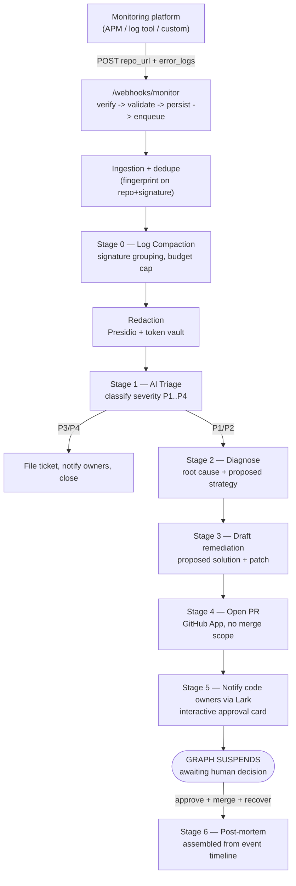

# 11 — Monitoring-Platform Trigger & Lark Notification

Status: proposed · extends [01-architecture.md](01-architecture.md), [04-integrations.md](04-integrations.md), [05-ai-pipeline.md](05-ai-pipeline.md)

## Purpose

A generic contract for **any** external data-monitoring platform (APM, log
aggregator, custom alerting rig — not only Alertmanager) to trigger Agent
Haaland by pushing a **source repository reference plus the raw error
signal**, and for the resulting remediation to notify code owners over
**Lark** instead of, or alongside, Slack. Everything downstream of ingestion
reuses the existing LangGraph orchestrator, redaction boundary, and
append-only event chain described in docs 01/03/05 — this document specifies
only what is new: the inbound contract, the pre-triage log-compaction stage,
and the Lark notifier adapter.

## End-to-end flow



---

## 1. Inbound trigger contract

### `POST /webhooks/monitor`

A new endpoint alongside `/webhooks/alertmanager` and `/webhooks/github`,
following the same five-step contract mandated in
[04-integrations.md](04-integrations.md#inbound-webhooks): verify → validate
→ persist → enqueue → return 2xx in under 500 ms. The handler does no
analysis; it exists to get the payload durably stored and a job on the
queue.

**Auth:** `Authorization: Bearer <MONITOR_WEBHOOK_TOKEN>` per registered
source, compared with `hmac.compare_digest`. Each monitoring platform that
integrates gets its own token, stored on a new `monitoring_sources` table
(§7), so a leaked token from one tool can be revoked without affecting
others.

**Request schema** (`MonitorSignal`, Pydantic, unknown fields rejected):

```json
{
  "source": "grafana-oncall",
  "source_event_id": "alert-8f21c0",
  "repo_url": "https://github.com/acme-bank/payments-api",
  "repo_ref": "main",
  "service_hint": "payments-api",
  "severity_hint": "critical",
  "occurred_at": "2026-08-15T09:12:03.117Z",
  "error_logs": [
    {
      "timestamp": "2026-08-15T09:12:03.100Z",
      "level": "ERROR",
      "message": "TimeoutError: connection pool exhausted after 5000ms (acct ACC-8829301)",
      "stack_trace": "  File \"app/db/pool.py\", line 88, in acquire\n  ...",
      "context": { "pod": "payments-api-7d9f", "trace_id": "a1b2c3" }
    }
  ],
  "metric_context": { "metric": "p99_latency_ms", "value": 4200, "threshold": 500 }
}
```

Field notes:

- `repo_url` is **required** and must resolve to a repository the GitHub
  App is installed on; if it does not, the signal is persisted with
  `status = "unroutable"` and a Lark message is sent to a fallback ops
  channel rather than silently dropped.
- `error_logs` accepts 1–2000 entries per request. A platform that wants to
  stream more sends multiple requests within the dedupe window (§2) — they
  correlate into one incident.
- Everything here is **untrusted, unredacted input**. It touches the
  redaction boundary (§3) before any model sees it, same as every other
  evidence source.

**Response:** `202 Accepted` with `{"incident_reference": "INC-2026-0091"}`
once persisted and enqueued — before compaction, redaction, or triage have
run.

### Idempotency

```python
key = f"dedupe:monitor:{source}:{source_event_id or fingerprint(repo_url, error_logs[0].message)}"
if await redis.set(key, incident_id, ex=settings.dedupe_window_seconds, nx=True):
    # new -> create incident, event(alert.received)
else:
    # existing -> attach signal, event(alert.correlated), skip re-triage
```

Same dedupe primitive as the Alertmanager path (`04-integrations.md`), just
keyed on `(source, event_id)` when the platform supplies one, falling back
to a hash of `(repo_url, normalized_first_error_line)`.

---

## 2. Stage 0 — Log compaction (the token-waste guard)

This runs **before** redaction and **before** any model call. Its job is
identical in spirit to the existing Loki summarisation described in
[04-integrations.md](04-integrations.md#loki-log-retrieval): raw error logs
are bursty and repetitive, and paying to send 2,000 near-duplicate lines to
the model both wastes budget and measurably hurts diagnosis quality (docs 05
makes this point about Loki; it applies identically to pushed logs).

```python
# apps/api/src/haaland/services/log_compaction_service.py

class LogSignature(BaseModel):
    signature: str          # normalised message, numbers/UUIDs/timestamps stripped
    count: int
    first_seen: datetime
    last_seen: datetime
    examples: list[LogLine] = Field(max_length=3)
    levels: dict[str, int]  # {"ERROR": 1840, "WARN": 12}

class CompactedLogBundle(BaseModel):
    signatures: list[LogSignature] = Field(max_length=5)
    total_lines_received: int
    total_lines_discarded: int
    truncated: bool
```

Algorithm:

1. Normalise each `message` — strip digits, UUIDs, timestamps, account-like
   tokens — to derive a signature (same normalisation approach as the Loki
   adapter, factored into a shared `normalize_log_signature()` so the two
   call sites cannot drift).
2. Group by signature; keep counts, first/last occurrence, and up to 3
   verbatim examples per signature (stack trace included on examples only,
   never on every line).
3. Keep the **top 5 signatures by count**. Everything else is dropped and
   accounted for in `total_lines_discarded` — this number is shown in the
   incident UI so a human can tell compaction happened.
4. Hard cap the serialized bundle at **4k tokens** (same budget line item as
   the Loki summary in the token-budget table, `05-ai-pipeline.md`). If the
   top-5 signatures still exceed it, examples are trimmed to 1 per
   signature before signatures themselves are dropped — counts survive
   longest, since "this occurred 1,847 times" is more diagnostic than one
   more raw example.

This is a ~10–50× reduction on real bursty logs and it is a pure function
with no model call, so it costs nothing and adds negligible latency
(target: **p95 < 200 ms** for 2,000 input lines).

### Why this stage exists as code, not a prompt instruction

Telling the model "please summarise, don't waste tokens" is not a control —
it is a request the model can only honour *after* the tokens are already
billed. Compaction must happen before the API call, deterministically, in
code that CI can unit-test against fixed input/output pairs.

---

## 3. Stages 1–4 — Triage, diagnosis, proposed fix, PR

These stages are **unchanged** from the existing pipeline
(`05-ai-pipeline.md`): the compacted, redacted bundle is classified
(`Classification`), diagnosed (`Diagnosis`, with `min_length=1` evidence
citations and a mandatory `contradicting_evidence` field), and a
remediation is drafted (`RemediationDraft`) and opened as a pull request via
the `SCMProvider` Protocol against the repository named in `repo_url`. The
same constraints apply without modification:

- No `action: "delete"` on file changes; a ten-file cap; path denylist.
- The diff is computed by our code against the real base SHA — the model
  supplies file contents, not a patch.
- The GitHub App has Contents + Pull-requests read/write and nothing that
  grants merge capability (`04-integrations.md`).
- Below `confidence < 0.5` on diagnosis, no fix is drafted; the incident
  pages a human marked `manual_investigation` instead.

The only addition here is that `repo_url` from the trigger payload is
authoritative for which repository the `SCMProvider` targets — it does not
need to be resolved from the `services` registry, though if it matches a
known `services.repo_full_name` the incident is still linked to that row for
ownership, Tier classification, and dashboard grouping.

---

## 4. Stage 5 — Notify code owners via Lark

### Why a distinct adapter, not a Slack lookalike

Lark's bot platform has a materially different interaction model from
Slack: a **custom webhook bot** can only push messages, it cannot receive
button-click callbacks. Receiving an "Approve" / "Reject" tap requires a
registered **Lark internal application** with a configured *card callback
URL*, its own app-level `app_id`/`app_secret`, and a `tenant_access_token`
exchange. The adapter is built against that, not the simpler webhook-only
bot, because the approval gate is the safety-critical interaction and it
must not silently degrade to "post a message and hope someone checks the
dashboard."

Implemented — see [13-lark-integration.md](13-lark-integration.md) for the
console walkthrough and the verification sequence. The adapter shipped as
`integrations/notify/lark/app_bot.py` over `…/lark/client.py`, alongside the
custom-bot transport in `…/lark/webhook_bot.py`; both are selected by
`HAALAND_LARK_MODE`.

```python
# apps/api/src/haaland/integrations/notify/lark/app_bot.py

class LarkAppNotifier:
    """Implements the Notifier Protocol (integrations/base.py).
    Auth: tenant_access_token, refreshed via app_id/app_secret, cached with
    a safety margin before its ~2h expiry."""

    async def notify(self, target: str, payload: dict) -> str:
        """target = Lark chat_id (resolved from CODEOWNERS logins via the
        users table's lark_open_id column, or a group chat_id for a
        per-incident channel). Returns message_id for later card updates."""
```

### Resolving who gets notified

Reuses `CodeownersService` unmodified
(`apps/api/src/haaland/services/codeowners_service.py`): parse
`.github/CODEOWNERS` from the target repo at the base SHA, map the PR's
changed paths to owning logins, last-matching-pattern-wins. The new piece is
mapping a resolved GitHub login to a Lark identity:

```sql
ALTER TABLE users ADD COLUMN lark_open_id text UNIQUE;
```

Seeded alongside `github_login` and `slack_user_id` in `seeds/users.yaml`.
A CODEOWNERS login with no `lark_open_id` on file falls back to the
`LARK_DEFAULT_CHANNEL` group chat with an @mention-by-name in the card text,
rather than being silently skipped — matching the existing "never fail the
PR, never fail the notification" posture in `codeowners_service.py`.

### Interactive card

Sent via `POST /open-apis/im/v1/messages?receive_id_type=chat_id` with
`msg_type: "interactive"`:

```json
{
  "receive_id": "oc_a1b2c3",
  "msg_type": "interactive",
  "content": "{\"card\":{ ... }}"
}
```

Card body, functionally equivalent to the existing Slack Block Kit card in
`04-integrations.md`, adapted to Lark's card schema:

```json
{
  "config": { "wide_screen_mode": true },
  "header": {
    "template": "red",
    "title": { "tag": "plain_text", "content": "P1 — payments-api latency" }
  },
  "elements": [
    { "tag": "div", "fields": [
      { "is_short": true, "text": { "tag": "lark_md", "content": "**Incident**\nINC-2026-0091" } },
      { "is_short": true, "text": { "tag": "lark_md", "content": "**Confidence**\n91%" } }
    ]},
    { "tag": "div", "text": { "tag": "lark_md",
      "content": "**Root cause**\nDeploy `a3f91c2` reduced `DB_POOL_SIZE` from 50 to 5." }},
    { "tag": "action", "actions": [
      { "tag": "button", "text": { "tag": "plain_text", "content": "Approve rollback" },
        "type": "primary", "value": { "action": "approve_remediation", "remediation_id": "<uuid>" } },
      { "tag": "button", "text": { "tag": "plain_text", "content": "Reject" },
        "type": "danger", "value": { "action": "reject_remediation", "remediation_id": "<uuid>" } },
      { "tag": "button", "text": { "tag": "plain_text", "content": "Open incident" },
        "type": "default", "url": "https://haaland.local/incidents/INC-2026-0091" }
    ]}
  ]
}
```

### `POST /webhooks/lark/interactions` — the callback

Lark signs card callbacks with a timestamp, nonce, and the app's Encrypt
Key. Verify before parsing, same non-negotiable ordering as every other
inbound webhook:

```python
def verify_lark_signature(headers: Mapping[str, str], body: bytes, encrypt_key: str) -> bool:
    timestamp = headers["X-Lark-Request-Timestamp"]
    nonce = headers["X-Lark-Request-Nonce"]
    if abs(time.time() - int(timestamp)) > 300:      # replay window, same 5 min as Slack
        return False
    basestring = f"{timestamp}{nonce}{encrypt_key}".encode() + body
    expected = hashlib.sha256(basestring).hexdigest()
    return hmac.compare_digest(expected, headers["X-Lark-Signature"])
```

Handler behaviour mirrors `POST /webhooks/slack/interactions`
(`04-integrations.md`) exactly:

1. Verify signature (above).
2. Resolve `value.action` and `remediation_id`.
3. Resolve the tapping user's `lark_open_id` to a `users` row — **reject
   unknown users**, do not create on the fly.
4. Authorise: the resolved user must hold role `approver` or `admin`. A
   valid Lark signature proves Lark sent the request, not that this person
   may approve a production rollback.
5. Insert `approvals` row with `channel = 'lark'`.
6. Emit `approval.granted` / `approval.denied` (hash-chained, same as
   every other event).
7. Update the card in place (`PATCH /open-apis/im/v1/messages/{message_id}`)
   to show "Approved by @priya — merging" so the Lark thread and the audit
   chain never disagree about what happened.
8. Resume the LangGraph checkpoint via `thread_id = incident_id`, identical
   resume mechanism to the Slack path (`05-ai-pipeline.md`).

### Per-incident group chat (optional, mirrors the Slack "dedicated channel")

For P1s, `POST /open-apis/im/v1/chats` creates `INC-2026-0091 — payments-api`,
invites the resolved code owners plus on-call, posts the summary card, and
archives it on incident close. Same rationale as the Slack per-incident
channel in `04-integrations.md`: the notification surface and the
compliance record should tell the same story without a human having to
reconcile two systems.

---

## 5. Stage 6 — Post-mortem generation

Unchanged from `05-ai-pipeline.md` §Stage 5: `claude-sonnet-5`, streamed,
timeline/timestamps/actors pulled from `incident_events` and rendered by
Jinja — the model writes prose around facts it does not restate. The only
addition is that the "human decisions" section of the post-mortem template
(`templates/postmortem.md.j2`) must render `channel: lark` approvals with
the same fidelity as `channel: slack` ones; this is a template change, not
a pipeline change.

---

## 6. Config surface (additions to `.env.example`)

```bash
# Generic monitoring-platform ingestion
MONITOR_WEBHOOK_TOKENS=            # JSON map: {"grafana-oncall": "...", "datadog": "..."}
MONITOR_LOG_COMPACTION_MAX_TOKENS=4000
MONITOR_LOG_COMPACTION_MAX_SIGNATURES=5

# Lark
LARK_APP_ID=
LARK_APP_SECRET=
LARK_ENCRYPT_KEY=                  # card-callback signature verification
LARK_VERIFICATION_TOKEN=
LARK_DEFAULT_CHANNEL=oc_fallback_ops_chat_id
```

All fail-fast at startup per the existing `config.py` convention
(`07-directory-structure.md`) when a configured monitoring source or the
Lark app is referenced but its secret is absent.

---

## 7. Data model additions

```sql
CREATE TABLE monitoring_sources (
  id            uuid PRIMARY KEY DEFAULT gen_random_uuid(),
  name          text NOT NULL UNIQUE,        -- 'grafana-oncall'
  webhook_token_hash bytea NOT NULL,         -- never store the raw token
  is_active     boolean NOT NULL DEFAULT true,
  created_at    timestamptz NOT NULL DEFAULT now()
);

ALTER TABLE signals
  ADD COLUMN repo_url text,
  ADD COLUMN compaction_stats jsonb;         -- {total_lines_received, total_lines_discarded, truncated}

ALTER TABLE users
  ADD COLUMN lark_open_id text UNIQUE;

-- notifications.channel already free-text ('slack' | 'pagerduty' | 'jira' | 'email');
-- add 'lark' as an accepted value at the application layer (no enum to migrate).

-- approvals.channel likewise gains 'lark' alongside 'slack' | 'web' | 'api'.
```

`incident_events` needs no schema change — `event_type = 'notification.sent'`
and `event_type = 'approval.granted'` already carry `actor_type` and a
`payload` jsonb; `payload.channel = "lark"` is sufficient, consistent with
the principle in `03-data-model.md` that the event schema is versioned as a
whole rather than grown column-by-column.

---

## 8. Non-functional requirements

| Requirement | Target | Rationale |
|---|---|---|
| Webhook handler latency | p95 < 500 ms | Matches existing inbound contract; slow handlers cause sender retries and duplicate incidents |
| Log compaction latency | p95 < 200 ms for 2,000 lines | Pure function, no I/O; must not become the pipeline's bottleneck |
| Compaction token budget | ≤ 4k tokens into the redaction stage | Same line item as the Loki summary budget in `05-ai-pipeline.md`'s token table |
| Per-incident LLM cost | ≤ `HAALAND_LLM_MAX_USD_PER_INCIDENT` (default $2.00) | Existing guardrail, unchanged, applies identically regardless of trigger source |
| Lark callback replay window | 300 s | Matches the Slack interaction window |
| Unknown Lark user on approval tap | Reject, log, do not create user | Matches Slack authorisation posture — signature ≠ authorisation |
| No merge capability granted to the GitHub App | Structural (no `merge()` on `SCMProvider`) | Unchanged core safety claim — see `docs/adr/0004-no-production-write-path.md` |
| Unroutable `repo_url` | Persist signal as `unroutable`, notify fallback Lark channel | Never silently drop a signal a monitoring platform believed it delivered |

## Explicit non-goals

- No new LLM stage. Log compaction is deterministic code, not a model call.
- No Lark-side automation beyond notify + receive-approval — no Lark
  bot commands, no Lark-native ticket creation.
- No change to the "cannot self-merge" safety property. Lark is a
  notification and approval-capture surface only, identical in authority to
  Slack.
